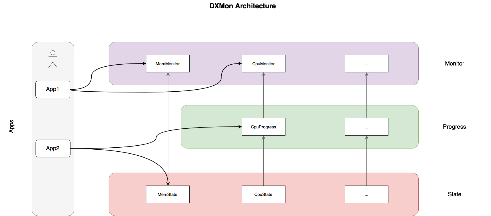

# DXMon

[](https://travis-ci.org/hhu-bsinfo/dxmon)

DXMon is a standalone monitoring-framework for Linux but also part of the distributed In-Memory key-value storage [DXRAM](https://github.com/hhu-bsinfo/dxram).
It is implemented in Java and uses the _proc_ virtual filesystem to collect monitoring information. 

## Quickstart

### Requirements

DXMon requires Java 1.8 to run on a Linux distribution of your choice. Furthermore procfs need to be mounted at ```/proc```.

### Dependencies

DXMon just needs the JDK internal tools library. The build system downloads it automatically. 

Furthermore, DXMon uses DXUtils which, by default, is downloaded from Bintray. In combination with DXRAM you can also use a local copy of it (for development). [See Quickstart Guide of DXRAM for more details.](https://github.com/hhu-bsinfo/dxram/blob/development/doc/QuickStart.md)


### Building

DXMon uses gradle as its build system and comes with a gradle-wrapper included, so you don't have to install gradle. Run ```./gradlew fatJar``` to build the project. The built ```dxmon-1.0.0.jar``` file is located in the ```build/lib``` directory.


### Starting DXMon

If you just want to see some CPU and memory statistics, you can use the following command to start DXMon with the preimplemented _MonitorTest_ class as classpath ```java -cp dxmon-1.0.0.jar de.hhu.bsinfo.dxmonitor.monitor.MonitorTest```. Nevertheless we recommend implemeting own classes.


## Architecture

DXMon has a modular structure. The class hierarchy can be devided into three types of layers: **states**, **progresses** and **monitors**. 

State classes only manage the read state. The data mainly read periodically from the proc file system. Only the JVM data is read out using the 
**J**ava **M**anagement E**x**tentsions.
Progress classes use the state classes to perform calculations periodically over a certain period of time. There is no monitoring logic at this point. 
The monitor classes contain the _real_ monitoring. Threshold classes are used to evaluate the collected/calculated data and may call a callback function. A callback function can be called several times.

An illustration is shown below for clarification:



## License

Copyright (C) 2018 Heinrich-Heine-Universitaet Duesseldorf, 
Institute of Computer Science, Department Operating Systems. 
Licensed under the [GNU General Public License](LICENSE).